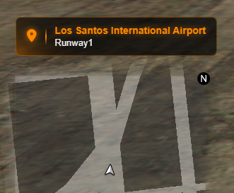
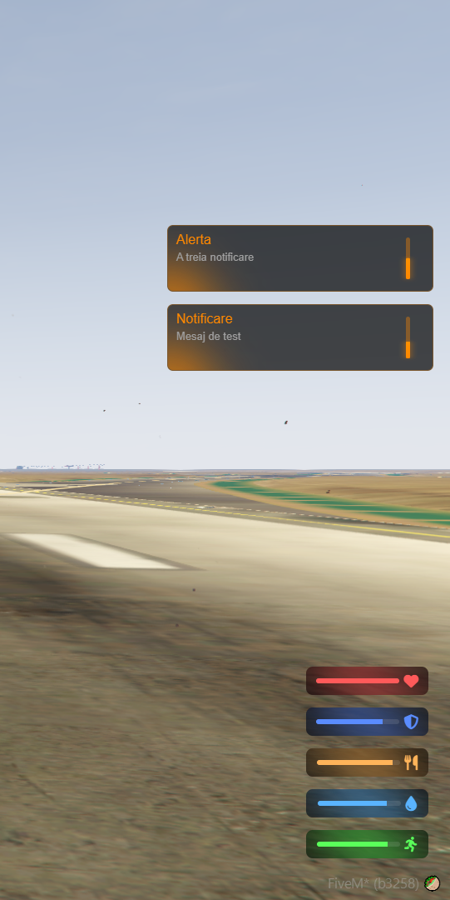
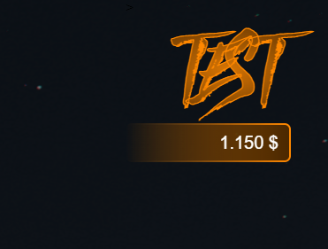
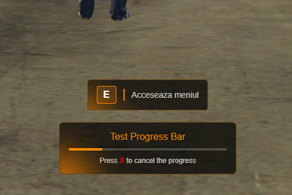
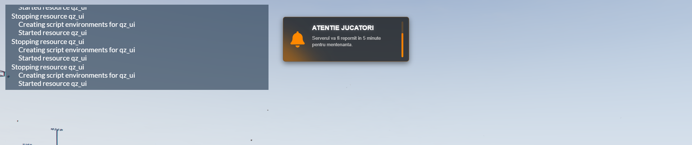
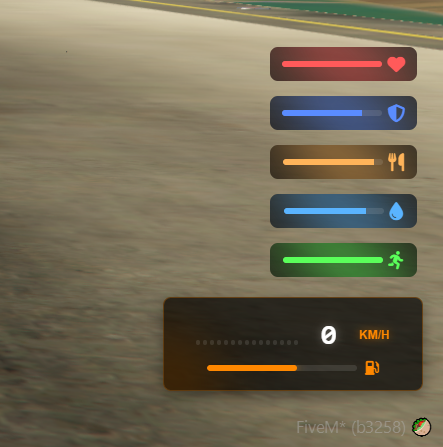
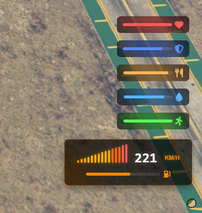
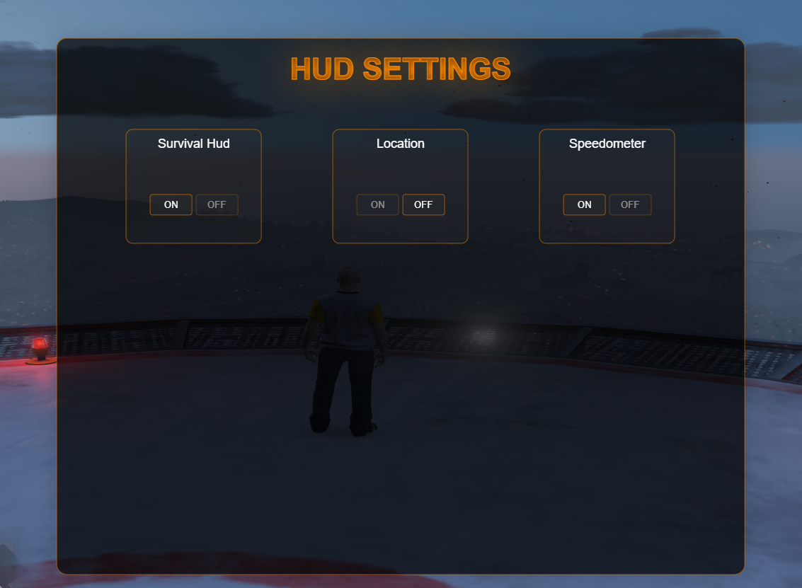

# qUizo UI


## Features

### ⚙️ Settings System
- Toggle HUD elements on/off (Survival HUD, Location, Speedometer)
- Real-time UI visibility control
- Accessible via /settings command
- And more coming soon

### 🗺️ GPS System
- Real-time street and zone display
- Automatic location updates
- Clean, minimalistic design that doesn't obstruct gameplay

### ❤️ Health & Survival HUD
- Real-time health, armor, hunger, and thirst display
- Dynamic stamina tracking during sprinting
- Color-coded indicators for easy status monitoring

### 💰 Money HUD
- Real-time wallet balance display
- Toggle with /hud command
- Automatic hide after 5 seconds
- Clean, minimalistic design

### 🔔 Notification System
- Customizable duration
- Sound effects

### 📊 Progress Bars
- Smooth animated progress indicators
- Cancelable with X key during active progress
- Automatic control disabling during progress
- Immediate movement restoration upon cancellation

### 📢 Admin Announcements
- Global admin announcements with sound effects
- Progress bar showing announcement duration
- Permission-based access
- Customizable title, message, and duration

### 🚗 Vehicle HUD
- Real-time speedometer (km/h)
- Fuel level display
- Automatic show/hide based on vehicle state
- Speed color changes at high velocities

### 💬 Text UI
- Clean, centered text display
- Perfect for instructions and information
- Easy show/hide functions

## Screenshots

### GPS Display


*Real-time location display showing current street and zone*

### Health & Notifications HUD


*Complete HUD showing health, armor, hunger, thirst, stamina, and notification system*

### Money HUD


*Real-time wallet balance display with toggle functionality*

### Text UI & Progress Bar


*Text UI for instructions and cancelable progress bar*

### Admin Announcement


*Global admin announcements with progress indicator*

### Health HUD & Speedometer


*Detailed health display and vehicle speedometer*

### Maximum Speed Display


*Speedometer at maximum velocity with color changes*

### Settings


## Installation

1. Download the script files
2. Place the `qz_ui` folder in your `resources` directory
3. Add `start qz_ui` to your `server.cfg`

## Configuration

### Permissions
Add this permission to your admin groups in `vrp/cfg/groups.lua`:

```lua
"admin.announce"  -- For admin announcements
```

### vRP Modifications Required

#### 1. Admin Module
Add this in your `vrp/modules/admin.lua`:

```lua
local function m_announce(menu)
  local user = menu.user
  if user then
    local message = user:prompt("Message: ", "")
    if message == "" then
      vRP.EXT.Base.remote._notify(user.source, "Announcement cancelled: No message provided.")
      return
    end
    TriggerClientEvent( "hud:admin", -1, "ADMIN ANNOUNCEMENT", message)
  end
end
```

Then add this in your `Admin Menu`:

```lua
if user:hasPermission("admin.announce") then
    menu:addOption("Admin Announcement", m_announce)
end
```

#### 2. Notifications (`vrp/client/base.lua`)
Edit your `Base:notify` with this one:

```lua
function Base:notify(msg,type,title,time)
    msg = msg
    title = title or "Notificare"
    time = time or 5000
    TriggerEvent("hud:notify", title, msg, time)
end
```

#### If you add these lines, you can continue using `vRP.EXT.Base.remote._notify()` for notifications.

## Usage

### Client Exports
```lua
-- Start a progress bar
TriggerEvent("progressBar:start", "Doing something...", 5000)

-- Show text UI
exports.qz_ui:ShowTextUI("Interact")

-- Hide text UI
exports.qz_ui:HideTextUI()

-- Notify
TriggerEvent("hud:notify", title, message, time)
```

### Server Events
```lua
-- Notify
TriggerClientEvent("hud:notify", user, "Title", "Message", duration)

-- Start progress bar
TriggerClientEvent("progressBar:start", user, "Title", duration)

-- Admin announcement
TriggerClientEvent("hud:admin", -1, "TITLE", "Message", 10000)
```

### Commands
- `/settings` - Open HUD settings menu
- `/testnoti` - Test notifications
- `/testtui` - Test text UI
- `/testprogress` - Test progress bar
- `/anunt` - Test admin announcement
- `/setfuel` - Test the fuel system for the speedometer
- `/hud` - Toggle money HUD display

## Dependencies

- vRP Framework
- Basic vRP modules (GUI, Survival, Base)

## Customization

### Colors & Styling
Edit the CSS files in `index/css/` to customize colors, fonts, and positioning.

### Sounds
Replace sound files in the `sounds/` directory with your own audio files.

### Key Bindings
Modify key codes in `client.lua` for different cancel keys or controls.

## Support

For issues or questions, please create an issue on the GitHub repository.

## License

This project is licensed under the MIT License - see the LICENSE file for details.
